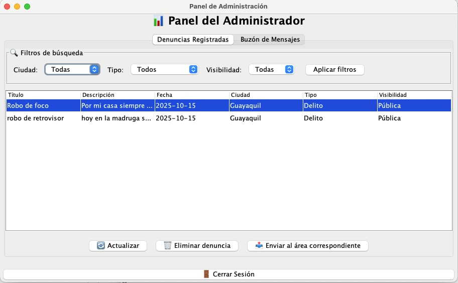

# 🚨 DenunciaEcuador: Gestión Anónima de Denuncias Ciudadanas

## 📝 Descripción del Proyecto

**DenunciaEcuador** es una aplicación de escritorio desarrollada en Java para la gestión anónima de denuncias ciudadanas en áreas clave como Aseo y Ornato, Tránsito Vial, y Delitos.

El sistema garantiza el **anonimato** del usuario y proporciona un **Buzón Personal** para la comunicación confidencial con las autoridades de control.

## 💻 Requisitos del Sistema

Para compilar y ejecutar este proyecto, se requiere tener instalado:

* **Java Development Kit (JDK):** Versión **25 (OpenJDK 25)** o superior.
* **Base de Datos:** El proyecto utiliza un archivo `denuncias.txt` para la persistencia de datos y clases de bases de datos internas (`*Database.java`).

---

## 🚀 Guía de Instalación y Ejecución

La estructura del código sigue el estándar de paquetes de Java, con el código fuente en `src/com/denuncias/ecuador/`.

### 1. Estructura de Archivos

| Carpeta/Archivo | Contenido |
| :--- | :--- |
| `src/` | **Código Fuente** (`.java`) |
| `bin/` | **Archivos Compilados** (`.class`) - Generados por el IDE. |

### 2. Compilación (Si no se usa el IDE)

Para compilar todos los archivos `.java` directamente desde la terminal (asegúrate de estar en el directorio raíz del proyecto `DenunciasEcuador`):

```bash
# Clonar el repositorio
git clone https://github.com/geespino/DenunciasEcuador

# Luego se debe cambiar al directorio DenunciasEcuador
cd DenunciasEcuador

# Compila todos los archivos del paquete en la carpeta bin/
javac -encoding UTF-8 -d bin src/com/denuncias/ecuador/*.java

# Navega a la carpeta de clases compiladas
cd bin

# Ejecuta la clase principal
java com.denuncias.ecuador.LoginFrame
```

### 3. Panel De Administración

